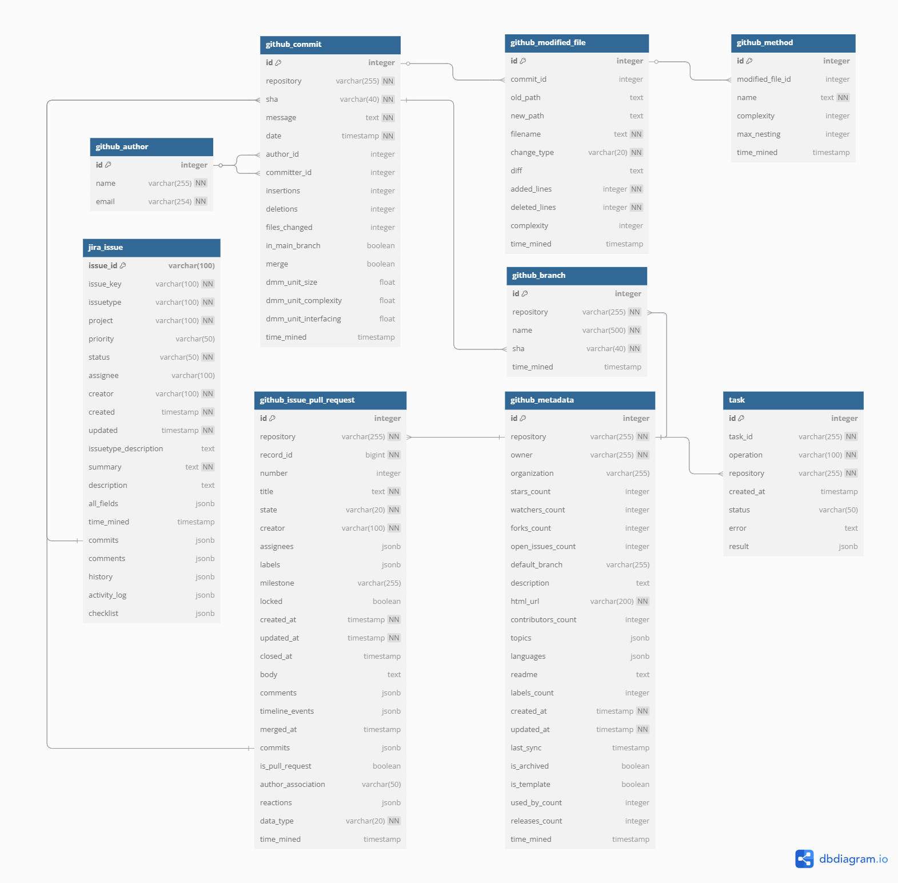

# RAISE

## Description

This is a Django-based API designed for mining and analyzing software development data, enabling the extraction of valuable insights from GitHub repositories and Jira projects. The tool provides detailed tracking of the project lifecycle, including commit analysis, pull requests, issues, and branches, offering critical insights into the development process.

## Features

1. **GitHub Mining**: Extract data from commits, pull requests, issues, and branches.
2. **Jira Mining**: Extract data from Jira issues.
3. **Temporal Analysis**: Monitor project evolution over time.
4. **Documented API**: Endpoints documented using DRF Spectacular.

## Requirements

Before starting, make sure you have the following programs installed:

### 1. Docker Desktop
- **Windows**:
  1. Download [Docker Desktop for Windows](https://docs.docker.com/desktop/install/windows-install/)
  2. Run the installer
  3. If prompted, enable WSL 2 (Windows Subsystem for Linux)
  4. Restart your computer after installation
  5. Verify the installation by opening terminal and typing: `docker --version`

- **macOS**:
  1. Download [Docker Desktop for Mac](https://docs.docker.com/desktop/install/mac-install/)
  2. Drag Docker to Applications folder
  3. Open Docker and allow installation of additional components
  4. Verify the installation by opening terminal and typing: `docker --version`

- **Linux (Ubuntu)**:
  ```bash
  sudo apt update
  sudo apt install docker.io
  sudo systemctl start docker
  sudo systemctl enable docker
  sudo usermod -aG docker $USER
  # Logout and login again
  docker --version
  ```

### 2. Docker Compose
- **Windows/macOS**: 
  - Already included in Docker Desktop

- **Linux**:
  ```bash
  sudo curl -L "https://github.com/docker/compose/releases/latest/download/docker-compose-$(uname -s)-$(uname -m)" -o /usr/local/bin/docker-compose
  sudo chmod +x /usr/local/bin/docker-compose
  docker-compose --version
  ```

### 3. Git
- **Windows**:
  1. Download [Git for Windows](https://git-scm.com/download/win)
  2. Run the installer
  3. Keep default options during installation
  4. Verify installation: `git --version`

- **macOS**:
  ```bash
  brew install git
  git --version
  ```

- **Linux (Ubuntu)**:
  ```bash
  sudo apt update
  sudo apt install git
  git --version
  ```

### Installation Verification

After installing all requirements, you can verify everything is working correctly by running:

```bash
# Verify Docker
docker --version

# Verify Docker Compose
docker-compose --version

# Verify Git
git --version
```

If all commands return the program versions, you're ready to proceed with the project installation.

## Installation and Configuration

1. **Clone the Repository**
   ```bash
   git clone https://github.com/aisepucrio/stnl-dataminer-api.git
   cd stnl-dataminer-api
   ```

2. **Configure a file named .env**
   
   Create a file named `.env` (this is the complete filename, not a file extension) at the root of the project with the following information:
   ```
   GITHUB_TOKENS="your_github_token"
   JIRA_API_TOKEN="your_jira_token"
   JIRA_EMAIL="your_jira_email"
   DJANGO_SUPERUSER_PASSWORD="your_superuser_password"
   POSTGRES_DB=your_database_name
   POSTGRES_USER=your_postgres_user
   POSTGRES_PASSWORD=your_postgres_password
   POSTGRES_HOST=postgres
   POSTGRES_PORT=5432
   ```
   
   Note: For instructions on how to generate your GitHub token, see the [Token Configuration](#token-configuration) section below.

3. **Verify the Line Format of `start.sh`**
   
   Open the `start.sh` file in your IDE and confirm that the line format is set to LF (this is usually visible at the bottom-right corner of the IDE). If it shows CRLF, change it to LF.

4. **Check for Existing Database or Server Conflicts**
   
   Ensure that no other PostgreSQL instances are running on port 5432. To check and terminate existing instances:
   
   1. Open Task Manager (Ctrl + Shift + Esc)
   2. Go to the "Processes" or "Details" tab
   3. Look for processes named "postgres" or "postgresql"
   4. Select each PostgreSQL-related process
   5. Click "End Task" or "End Process"

5. **Start the Containers**
   
   1. Open Docker Desktop and wait until it's fully initialized
   2. Run the command:
   ```bash
   docker compose up --build
   ```
## Token Configuration

### How to Generate a GitHub Token:

1. Go to [GitHub Settings > Developer Settings > Personal Access Tokens > Tokens (classic)](https://github.com/settings/tokens).
2. Click on "Generate new token (classic)".
3. Select the following scopes:
   - `repo` (full access to repositories)
   - `read:org` (read organization data)
   - `read:user` (read user data)
4. Generate the token and copy it immediately.

### How to Generate a Jira Token:

1. Go to [Jira API Tokens](https://id.atlassian.com/manage-profile/security/api-tokens).
2. Click on **Create API token**.
3. Enter a label/name for your token (e.g., "RAISE API Access") and click **Create**.
4. Click **Copy to clipboard** to copy your new token.  
   **Important:** You will not be able to see this token again, so save it securely.
5. Use this token in your `.env` file as the value for `JIRA_API_TOKEN`.
6. For more details, see the [official Atlassian documentation](https://support.atlassian.com/atlassian-account/docs/manage-api-tokens-for-your-atlassian-account/).

### Configuring Multiple Tokens:

To avoid API rate limits, you can configure multiple tokens. In the `.env` file, add them separated by commas:

```
GITHUB_TOKENS='token1,token2,token3'
JIRA_TOKEN='token1,token2,token3' 
```

The API will automatically switch between tokens when one reaches its request limit.

## Using the API

The API provides various endpoints for data mining. To test the endpoints, we recommend using one of the following tools:

- [Postman](https://www.postman.com/downloads/) - Popular GUI for API testing
- [Bruno](https://www.usebruno.com/) - Open source alternative to Postman

### **GitHub Mining**

#### Overview

The API provides endpoints for both **data collection (mining)** and **data querying** from GitHub repositories. You can collect and query commits, issues, pull requests, branches, and repository metadata. Below you will find detailed explanations, parameter descriptions, and real-world examples for each endpoint.

#### **Collection Endpoints (POST)**

1. **Commit Collection**
   ```http
   POST http://localhost:8000/api/github/commits/collect/
   Content-Type: application/json

   {
       "repo_name": "facebook/react",
       "start_date": "2023-01-01T00:00:00Z",
       "end_date": "2023-12-31T00:00:00Z"
   }
   ```
   - `repo_name` (**required**): Repository in the format `owner/repo`.
   - `start_date`/`end_date` (**optional**): ISO 8601 format. Limits the commit range.
   - `commit_sha` (**optional**): If provided, fetches only the specified commit.  
     **Note:** When using `commit_sha`, you do **not** need to provide `start_date` or `end_date`.

   **Example (date range):**
   ```json
   {
       "repo_name": "grafana/github-datasource",
       "start_date": "2023-01-01T00:00:00Z",
       "end_date": "2023-12-31T23:59:59Z"
   }
   ```

   **Example (specific commit by SHA):**
   ```json
   {
       "repo_name": "grafana/github-datasource",
       "commit_sha": "a1b2c3d4e5f6g7h8i9j0"
   }
   ```

2. **Issue Collection**
   ```http
   POST http://localhost:8000/api/github/issues/collect/
   Content-Type: application/json

   {
       "repo_name": "tensorflow/tensorflow",
       "start_date": "2023-01-01T00:00:00Z",
       "end_date": "2023-12-31T00:00:00Z",
       "depth": "basic"
   }
   ```
   - `depth`: `"basic"` (default) collects basic info; `"complex"` includes comments and timeline.

   **Example:**
   ```json
   {
       "repo_name": "pandas-dev/pandas",
       "depth": "complex"
   }
   ```

3. **Pull Request Collection**
   ```http
   POST http://localhost:8000/api/github/pull-requests/collect/
   Content-Type: application/json

   {
       "repo_name": "kubernetes/kubernetes",
       "start_date": "2023-01-01T00:00:00Z",
       "end_date": "2023-12-31T00:00:00Z",
       "depth": "basic"
   }
   ```

4. **Branch Collection**
   ```http
   POST http://localhost:8000/api/github/branches/collect/
   Content-Type: application/json

   {
       "repo_name": "django/django"
   }
   ```

5. **Metadata Collection**
   ```http
   POST http://localhost:8000/api/github/metadata/collect/
   Content-Type: application/json

   {
       "repo_name": "microsoft/vscode"
   }
   ```

---

#### **Query Endpoints (GET)**

Below are the main GET endpoints for querying mined GitHub data, with examples, explanations, and available filters for each data type.

---

1. **Query Commits**
   ```http
   GET http://localhost:8000/api/github/commits/?repository=owner/repository&created_after=2023-01-01&created_before=2023-12-31
   ```
   **Available filters:**
   - `repository`: Repository name (`owner/repository`)
   - `created_after`: Start date (ISO 8601)
   - `created_before`: End date (ISO 8601)
   - `message`: Search for text in the commit message
   - `author_name`: Commit author's name
   - `sha`: Specific commit SHA

   **Example:**
   ```
   GET http://localhost:8000/api/github/commits/?repository=facebook/react&created_after=2023-01-01&created_before=2023-12-31
   ```

---

2. **Query Issues**
   ```http
   GET http://localhost:8000/api/github/issues/?repository=owner/repository&state=open&created_after=2023-01-01
   ```
   **Available filters:**
   - `repository`: Repository name
   - `created_after`: Start date (ISO 8601)
   - `created_before`: End date (ISO 8601)
   - `updated_after`: Updated after (ISO 8601)
   - `updated_before`: Updated before (ISO 8601)
   - `title`: Search in issue title
   - `creator`: Issue creator
   - `state`: Issue state (`open`, `closed`)
   - `has_label`: Filter by label

   **Example:**
   ```
   GET http://localhost:8000/api/github/issues/?repository=tensorflow/tensorflow&state=open&created_after=2023-01-01
   ```

---

3. **Query Pull Requests**
   ```http
   GET http://localhost:8000/api/github/pull-requests/?repository=owner/repository&state=merged&created_after=2023-01-01
   ```
   **Available filters:**
   - All filters from the Issues endpoint
   - `state`: Pull request state (`open`, `closed`, `merged`)
   - `has_label`: Filter by label

   **Example:**
   ```
   GET http://localhost:8000/api/github/pull-requests/?repository=kubernetes/kubernetes&state=merged&created_after=2023-01-01
   ```

---

4. **Query Branches**
   ```http
   GET http://localhost:8000/api/github/branches/?repository=owner/repository
   ```
   **Available filters:**
   - `repository`: Repository name
   - `name`: Branch name (supports partial match)

   **Example:**
   ```
   GET http://localhost:8000/api/github/branches/?repository=django/django
   ```

---

5. **Query Metadata**
   ```http
   GET http://localhost:8000/api/github/metadata/?repository=owner/repository
   ```
   **Available filters:**
   - `repository`: Repository name

   **Example:**
   ```
   GET http://localhost:8000/api/github/metadata/?repository=microsoft/vscode
   ```

---

6. **Dashboard**
   ```http
   GET http://localhost:8000/api/github/dashboard/?repository_id=1&start_date=2023-01-01T00:00:00Z
   ```
   This endpoint provides statistical summaries of the mined data, either globally (all repositories) or for a specific repository, depending on the parameters you provide.

   **Available parameters:**
   - `repository_id` (optional): ID of the repository for detailed stats. If omitted, returns global stats for all repositories.
   - `start_date` (optional): Filter stats from this date (ISO 8601).
   - `end_date` (optional): Filter stats up to this date (ISO 8601).

   **Response examples:**

   - **Global summary (no `repository_id`):**
     ```json
     {
       "issues_count": 500,
       "pull_requests_count": 200,
       "commits_count": 2000,
       "repositories_count": 5,
       "repositories": [
         {"id": 1, "repository": "owner/repo1"},
         {"id": 2, "repository": "owner/repo2"}
       ]
     }
     ```

   - **Repository-specific summary (with `repository_id`):**
     ```json
     {
       "repository_id": 1,
       "repository_name": "owner/repo",
       "issues_count": 120,
       "pull_requests_count": 45,
       "commits_count": 500,
       "forks_count": 25,
       "stars_count": 100,
       "watchers_count": 30,
       "time_mined": "2023-01-01T12:00:00Z"
     }
     ```

   **Example usage:**
   ```
   GET http://localhost:8000/api/github/dashboard/
   GET http://localhost:8000/api/github/dashboard/?start_date=2023-01-01T00:00:00Z&end_date=2023-12-31T23:59:59Z
   GET http://localhost:8000/api/github/dashboard/?repository_id=1
   GET http://localhost:8000/api/github/dashboard/?repository_id=1&start_date=2023-01-01T00:00:00Z
   ```

---

#### **Request Parameters Summary**

**Collection Endpoints (POST body):**

- `repo_name` (**required**):  
  The repository to mine, in the format `owner/repo` (e.g., `"pandas-dev/pandas"`).

- `start_date` (**optional**):  
  The initial date for mining/filtering data, in ISO 8601 format (`YYYY-MM-DDTHH:MM:SSZ`).  
  *If not provided, mining will start from the earliest available data.*

- `end_date` (**optional**):  
  The final date for mining/filtering data, in ISO 8601 format.  
  *If not provided, mining will include data up to the most recent available.*

- `depth` (**optional**):  
  The mining depth.  
  - `"basic"` (default): Collects main information only.  
  - `"complex"`: Collects additional details such as comments, events, etc.

- `commit_sha` (**optional**, only for commit mining):  
  If provided, fetches only the specified commit.  
  *When using `commit_sha`, you do not need to provide `start_date` or `end_date`.*

---

**Query Endpoints (GET parameters):**

- `repository`: Filter by repository name (`owner/repo`).
- `created_after` / `created_before`: Filter items by creation date range (ISO 8601).
- `updated_after` / `updated_before`: Filter items by update date range (ISO 8601).
- `state`: Filter by state (e.g., `"open"`, `"closed"`, `"merged"`).
- `has_label`: Filter by label (for issues and pull requests).
- Ordering:
  - `ordering`: Order results by a specific field (e.g., `ordering=created_at` or `ordering=-updated_at`).

---

**Important:**  
- If you do **not** provide `start_date` and `end_date` in collection requests, the API will mine **all available data** for the specified repository.
- For large repositories, it is recommended to use date filters to avoid long processing times and rate limits.
---

### **Jira Mining**

#### Overview

The API provides endpoints for both **collecting** and **querying** Jira issues, enabling you to extract, filter, and analyze issues from any Jira project you have access to. Below you will find detailed explanations, parameter descriptions, and real-world examples for each endpoint.

---

#### **1. Collect Issues (POST)**

**Endpoint:**  
`POST /api/jira/issues/collect/`

**Description:**  
Starts an asynchronous mining job to collect issues from a specified Jira project. You can track the progress and result of this job using the jobs endpoints.

**Request Body Parameters:**

| Parameter      | Required? | Type     | Description                                                                                   | Example                        |
|----------------|-----------|----------|-----------------------------------------------------------------------------------------------|--------------------------------|
| `jira_domain`  | Yes       | string   | Your Jira domain (e.g., `yourcompany.atlassian.net`)                                          | `"ecosystem.atlassian.net"`    |
| `project_key`  | Yes       | string   | The project key in Jira (e.g., `PROJ`, `AO`, `ACCESS`)                                        | `"AO"`                         |
| `issuetypes`   | No        | array    | List of issue types to filter (e.g., `["Bug", "Task"]`). If omitted, all types are collected. | `["Bug", "Story"]`             |
| `start_date`   | No        | string   | Start date for mining (format: `"yyyy-MM-dd"` or `"yyyy-MM-dd HH:mm"`). If omitted, collects from the earliest available. | `"2011-11-15"`                 |
| `end_date`     | No        | string   | End date for mining (same format as above). If omitted, collects up to the most recent.       | `"2013-12-27"`                 |

**Example Request:**
```json
{
    "jira_domain": "ecosystem.atlassian.net",
    "project_key": "AO",
    "issuetypes": ["Bug", "Documentation"],
    "start_date": "2011-11-15",
    "end_date": "2013-12-27"
}
```

- If you omit `issuetypes`, all issue types will be collected.
- If you omit `start_date` and `end_date`, all issues in the project will be collected.

**More real project examples:**
- [Explore AO Issues](https://ecosystem.atlassian.net/jira/software/c/projects/AO/issues/?jql=project%20%3D%20%22AO%22%20ORDER%20BY%20created%20DESC)
- [Explore ACCESS Issues](https://ecosystem.atlassian.net/jira/software/c/projects/ACCESS/issues/?jql=project%20%3D%20%22ACCESS%22%20ORDER%20BY%20created%20DESC)
- You can find more projects to test at [ecosystem.atlassian.net](https://ecosystem.atlassian.net).

---

#### **2. List Issues (GET)**

**Endpoint:**  
`GET /api/jira/issues/`

**Description:**  
Returns a paginated list of all Jira issues stored in the database. You can filter, search, and order the results using the parameters below.

**Available Query Parameters:**

- **Date Filters:**
  - `created_after`: Only issues created on or after this date (e.g., `2023-01-01T00:00:00Z`)
  - `created_before`: Only issues created on or before this date
  - `updated_after`: Only issues updated on or after this date
  - `updated_before`: Only issues updated on or before this date

- **Text Search:**
  - `summary`: Search for issues whose summary contains a specific term (case-insensitive)
  - `description`: Search for issues whose description contains a specific term
  - `creator`: Filter by the creator's name
  - `assignee`: Filter by the assignee's name

- **Exact Match:**
  - `status`: Filter by issue status (e.g., `Open`, `Closed`)
  - `project`: Filter by project key (e.g., `PROJ`)
  - `priority`: Filter by priority (e.g., `High`, `Low`)
  - `issuetype`: Filter by issue type (e.g., `Bug`, `Task`)

- **Ordering:**
  - `ordering`: Sort results by `created`, `updated`, `priority`, or `status`
    - Example: `?ordering=created` (ascending) or `?ordering=-updated` (descending)

**Examples:**

- Fetch all issues:
  ```
  GET http://localhost:8000/api/jira/issues/
  ```
- Fetch issues created after a specific date:
  ```
  GET http://localhost:8000/api/jira/issues/?created_after=2023-01-01
  ```
- Search for issues containing "login" in the summary:
  ```
  GET http://localhost:8000/api/jira/issues/?summary=login
  ```
- Filter issues assigned to a specific user:
  ```
  GET http://localhost:8000/api/jira/issues/?assignee=johndoe
  ```
- Combine filters (e.g., open issues in project `PROJ` created after 2023-01-01):
  ```
  GET http://localhost:8000/api/jira/issues/?project=PROJ&status=Open&created_after=2023-01-01
  ```
- Order issues by priority:
  ```
  GET http://localhost:8000/api/jira/issues/?ordering=priority
  ```

---

#### **3. Issue Details (GET)**

**Endpoint:**  
`GET /api/jira/issues/{issue_key}/`

**Description:**  
Fetches detailed information for a specific Jira issue by its key.

**Example:**

```
GET http://localhost:8000/api/jira/issues/PROJ-123/
```

- Replace `PROJ-123` with the actual issue key you want to retrieve.

---

#### **4. Jira Dashboard (GET)**

**Endpoint:**  
`GET /api/jira/dashboard/`

**Description:**  
Returns statistical summaries about the mined Jira issues, either globally (all projects) or for a specific project, depending on the parameters provided.

**Available Query Parameters:**
- `project_name` (optional): Project key for detailed stats. If omitted, returns global stats for all projects.
- `start_date` / `end_date` (optional): Filter stats by date range.

**Examples:**
- All projects:
  ```
  GET http://localhost:8000/api/jira/dashboard/
  ```
- Specific project and date range:
  ```
  GET http://localhost:8000/api/jira/dashboard/?project_name=AO&start_date=2011-11-15&end_date=2013-12-27
  ```

**Response Example (global):**
```json
{
  "issues_count": 500,
  "projects_count": 5,
  "projects": ["AO", "ACCESS", "PROJ", ...]
}
```

**Response Example (project-specific):**
```json
{
  "project_name": "AO",
  "issues_count": 120,
  "time_mined": "2023-01-01T12:00:00Z"
}
```

---

**Tips:**
- All dates can be provided in `"yyyy-MM-dd"` or `"yyyy-MM-dd HH:mm"` format and are interpreted in the project's timezone.
- If you do not provide `start_date` and `end_date`, the API will return or mine all available data.
- Use filters and ordering to efficiently explore large datasets.
- For private Jira projects, your API token must have the necessary permissions.

---

### Jobs Endpoints

The API provides endpoints to **monitor, list, and manage mining jobs (tasks)**. These are essential for tracking the progress and results of asynchronous mining operations.

---

#### 1. **List all jobs (tasks)**
```http
GET /api/jobs/
```
- Returns a paginated list of all mining tasks that have been created (scheduled, running, or finished).
- Each entry includes: `task_id`, operation, repository, status, error (if any) and creation date.

---

#### 2. **Check the status of a specific job**
```http
GET /api/jobs/tasks/{task_id}/
```
- Returns the current status of the specified task (`PENDING`, `STARTED`, `SUCCESS`, `FAILURE`, etc).
- If the task is finished, also returns the result or error.

**Example response:**
```json
{
  "task_id": "b1c2d3e4f5",
  "status": "SUCCESS"
}
```

---

#### 3. **Cancel a running job**
```http
DELETE /api/jobs/tasks/{task_id}/
```
- Cancels a task that is still running (`PENDING` or `STARTED`).
- Updates the status to `REVOKED` and stores a cancellation message.

**Example response:**
```json
{
  "task_id": "b1c2d3e4f5",
  "status": "Task canceled and marked as failed"
}
```

---

#### **Summary of usage**

- Use `/api/jobs/` to see the history of all mining tasks.
- Use `/api/jobs/tasks/{task_id}/` to monitor the progress or result of a specific task.
- Use the DELETE method on `/api/jobs/tasks/{task_id}/` to cancel a task that is still running.

These endpoints are essential for tracking and managing asynchronous mining executions in your API!

### Response Format

- **Collection endpoints return:**

```json
{
    "task_id": "task-uuid",
    "message": "Task successfully initiated",
    "status_endpoint": "http://localhost:8000/api/jobs/tasks/task-uuid/"
}
```

You can check the status and result of the task at the `status_endpoint`.

- **Query endpoints return:**  
  Paginated lists of items in JSON format.

---

### General Notes

- All dates must be in ISO 8601 format: `YYYY-MM-DDTHH:mm:ssZ` (for Jira, also accepts `YYYY-MM-DD`).
- Collection endpoints return HTTP `202 Accepted` with a task object.
- Query endpoints return HTTP `200 OK` with paginated results.
- Pagination and ordering are supported on all list endpoints.
- For large datasets or repositories, use smaller date ranges to improve performance and avoid timeouts.
- To mine private repositories or projects (GitHub or Jira), your token must have appropriate access permissions.

---

### Jira-Specific Notes

3. The `project_key` must match an existing project in the Jira domain.
4. If `start_date` and `end_date` are not provided, all available issues will be mined.
5. If no `issuetypes` are specified, all issue types will be mined.
6. Dates can be provided in `"yyyy-MM-dd"` or `"yyyy-MM-dd HH:mm"` format, interpreted in the project's timezone.

## Data Storage

After mining is complete, all data is stored in a **PostgreSQL** database that runs internally within the Docker environment. This means you do not need to install PostgreSQL manually on your host machine—the database is automatically provisioned and managed by Docker Compose as part of the application stack.

### How to Access the Database

You can access and explore the mined data using your favorite database client. Here are some recommended options:

- **TablePlus** (recommended for a modern GUI experience)
- **pgAdmin** (classic web-based GUI)

#### Example: Connecting with TablePlus

1. Open TablePlus and click "Create a new connection".
2. Choose **PostgreSQL**.
3. Fill in the connection details using the same values as in your `.env` file:
   - **Host**: `localhost`
   - **Port**: `5432`
   - **Database**: your `POSTGRES_DB` value from `.env`
   - **Username**: your `POSTGRES_USER` value from `.env`
   - **Password**: your `POSTGRES_PASSWORD` value from `.env`
4. Click "Connect" to access and browse your data.

#### Example: Connecting with pgAdmin

1. Open pgAdmin.
2. Right-click on "Servers" > "Register" > "Server".
3. In the "General" tab, give your connection a name.
4. In the "Connection" tab, fill in:
   - **Host**: `localhost`
   - **Port**: `5432`
   - **Database**: your `POSTGRES_DB` value from `.env`
   - **Username**: your `POSTGRES_USER` value from `.env`
   - **Password**: your `POSTGRES_PASSWORD` value from `.env`
5. Save and connect.

---

## Database Model

The application uses a PostgreSQL database to store all mined information from GitHub and Jira. The data model was carefully designed to ensure integrity, performance, and flexibility for future analysis.

Below is the entity-relationship (ER) diagram representing the main tables and relationships in the system:



### Main Tables

- **github_commit**: Stores mined commits from GitHub repositories.
- **github_issue_pull_request**: Stores issues and pull requests from GitHub.
- **github_branch**: Stores repository branches.
- **github_metadata**: Stores metadata about GitHub repositories.
- **jira_issue**: Stores mined issues from Jira projects.
- **task**: Manages the history and status of asynchronous mining tasks.

The relationships between these tables allow you to track, for example, which commits are associated with which branches, issues, or tasks.

---