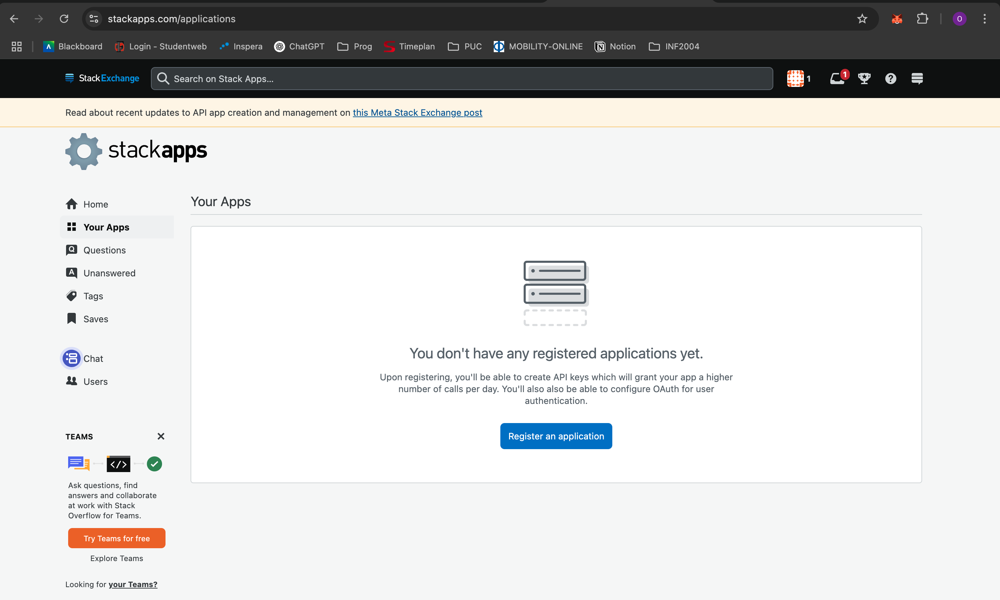
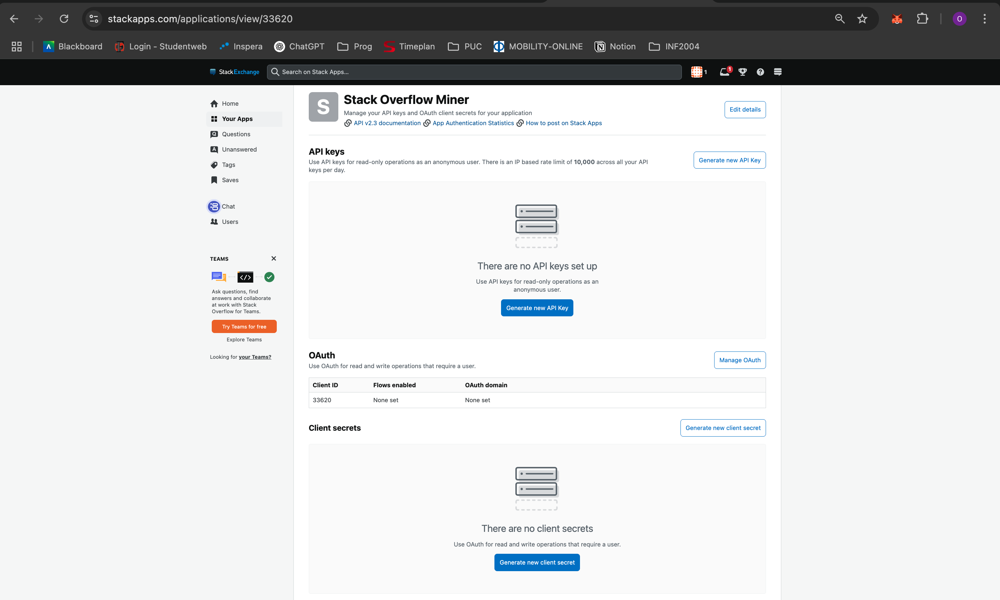
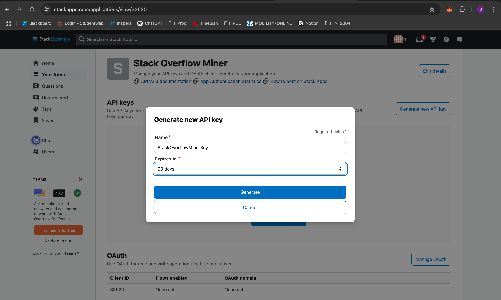
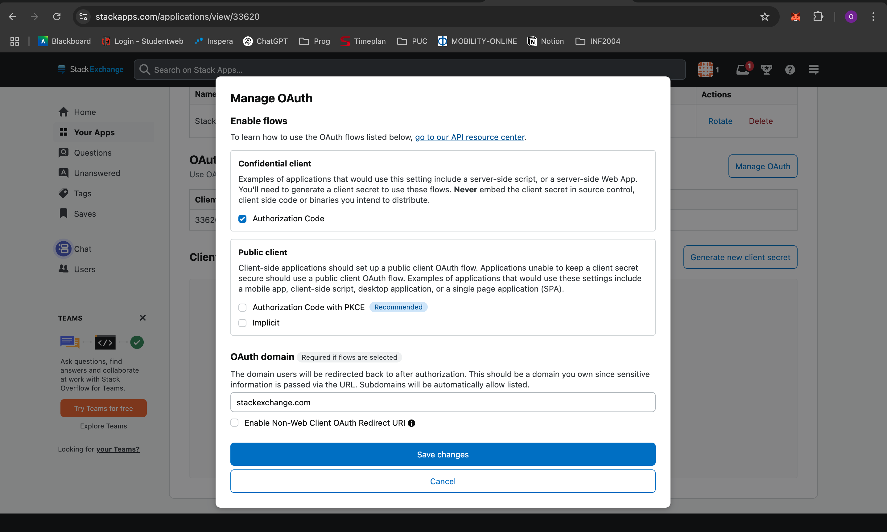
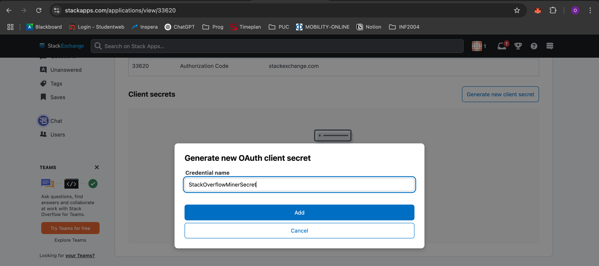
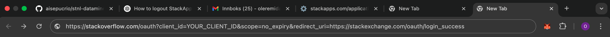
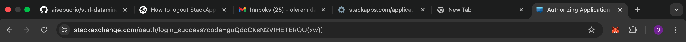
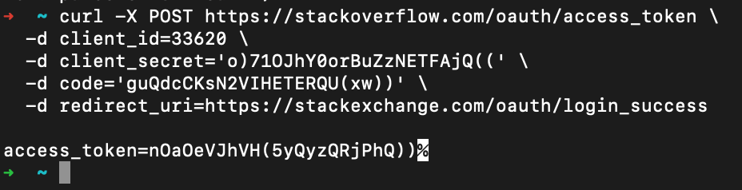

# Stack Exchange API – 2025 Guide: How to Generate an OAuth Access Token

This guide shows how to create an application on StackApps, configure OAuth, and obtain an **Access Token** to make authenticated requests to the Stack Exchange API.

---

## Step 1: Register Your Application

1. Go to: [https://stackapps.com/apps](https://stackapps.com/apps)  
2. Log in / Sign up  
3. Click **“Register an application”**



4. Fill in the fields:
   - **Application name**: `Stack Overflow Miner` (or another name)
   - **Application description**: short description (e.g., `Application to mine Stack Overflow data`)
   - **Application URL**: `https://stackexchange.com`
   - **Application icon**: optional
   - ✅ Check “I agree to the terms and conditions”

5. Click **Register application**

---



1. Click **“Generate new API key”**
2. Fill in:
   - **Name**: e.g., `StackOverflowMinerKey`
   - **Expires in**: `90 days`



3. Click **Generate**

---

## Step 3: Configure OAuth

1. Click **“Manage OAuth”**



2. Check:
   - ✅ **Confidential client** → **Authorization Code**
   - **OAuth domain**: `stackexchange.com`
   - ⛔️ **Do not check** “Enable Non-Web Client OAuth Redirect URI”

3. Click **Save changes**

---

## Step 4: Create a Client Secret

1. Click **“Generate new client secret”**
2. Name it as you prefer (e.g., `StackOverflowMinerSecret`)
3. Click **Add**



4. Save the secret.  
---

## Step 5: Authorize the Application and Get the Code

Open this link in your browser (replace `YOUR_CLIENT_ID`):

https://stackoverflow.com/oauth?client_id=YOUR_CLIENT_ID&scope=no_expiry&redirect_uri=https://stackexchange.com/oauth/login_success

Log in, authorize the application, and copy the `code` from the URL:


https://stackexchange.com/oauth/login_success?code=YOUR_CODE_HERE



---

## 📬 Step 6: Exchange the Code for an Access Token

Run the following command in your terminal:

```bash
curl -X POST https://stackoverflow.com/oauth/access_token \
  -d client_id=YOUR_CLIENT_ID \
  -d client_secret='YOUR_CLIENT_SECRET' \
  -d code='YOUR_CODE' \
  -d redirect_uri=https://stackexchange.com/oauth/login_success
```

Use single quotes '...' if the value contains characters like ( or ).



Save the token. 

